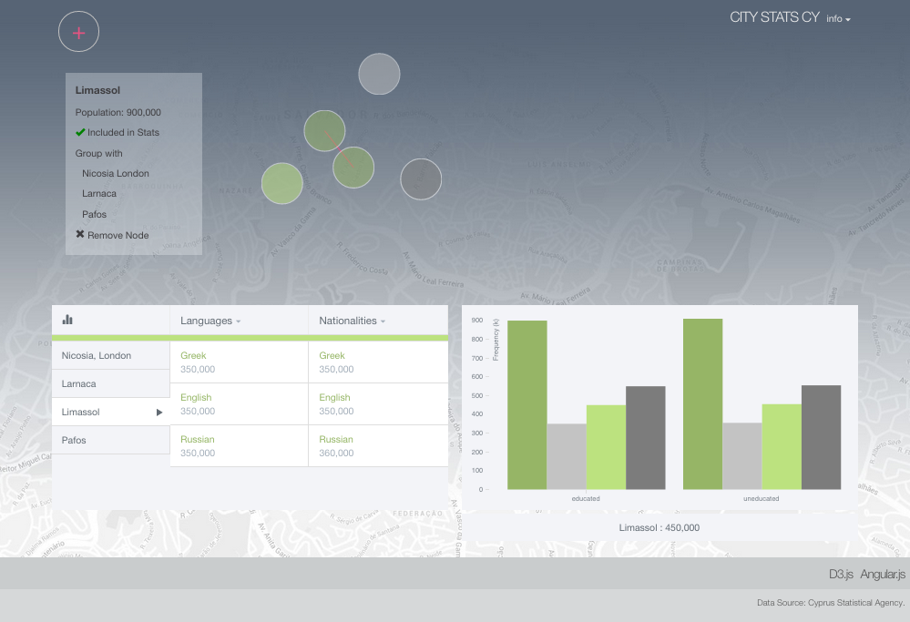

# Open City Stats

Open Data visualisation built in Angular and D3.js.

## About

Open City Stats is a stand-alone client application built in [Angular](https://angularjs.org/) and [D3.js](http://d3js.org/) intended for exploring statistical data. The current implementation explores statistics about cities and villages in [Cyprus](http://en.wikipedia.org/wiki/Cyprus). These can be grouped together via the graphical interface for aggregated results, hence deeper exploration and comparison.

The project is currently under development, needs code clean-up and extensions, but it is in fully working condition. Clone the repo, place in your web server, and open index.html in any modern browser to try it out. A dummy dataset (data.json) is used for testing and demonstrating purposes. The final product will be released as a generic client-side application.

### Screenshots

Background map image from Google Maps.
