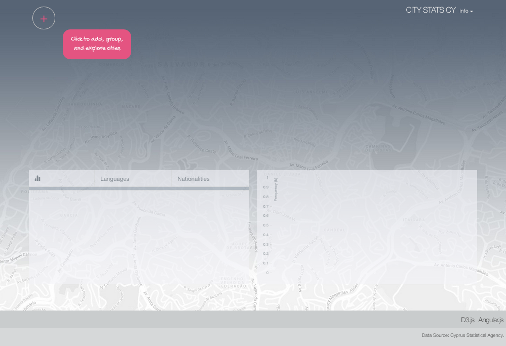

# City Stats mashup

## About

City Stats mashup is a stand-alone Open Data visualisation built in [Angular](https://angularjs.org/) and [D3.js](http://d3js.org/) intended for exploring statistical/demographic data about cities and villages. These can be grouped together via the graphical interface for aggregated results, hence deeper exploration and comparison. 

The project is under development, but it is in fully working condition. An online deployment exploring cities and villages in Cyprus will be available soon. See screenshots below for what to expect in a live deployment using a dummy dataset. Follow the steps next to clone the repo and run the demo locally.

### Screenshots

Adding and grouping nodes/cities:

## Install & Run Locally

The project uses the MEAN project structure/configuration available [here](https://github.com/chriskmnds/mean-clean-2). All development scripts are provided in this repo. To load the demo locally, simply clone [citystats-mashup](https://github.com/chriskmnds/citystats-mashup.git) and follow these steps:

### Prerequisites

1. Install Node.js and npm (http://nodejs.org/).
2. Install bower and gulp:
	
	`npm install -g bower`

	`npm install -g gulp`

### Install/Run

1. Change directory to `app-angular`
2. Install required npm and bower packages:

	`npm install`

3. If all successful, start the server:

	`npm start`

This should start the application (`http://localhost:8000`) in a new browser window. Build option is set to production (read [here](https://github.com/chriskmnds/mean-clean-2) for further details). You should be able to interact with app right away.

Start-up state of the application:

## Development Notes

The following D3 custom modules are used for the dynamic chart and force-layout implementations:

- [D3 Dynamic Grouped Bar Chart](https://github.com/chriskmnds/d3-dynamic-grouped-bar-chart)
- [D3 Force Layout API](https://github.com/chriskmnds/d3-force-layout-api)

## License

MIT

Background map image from Google Maps.
